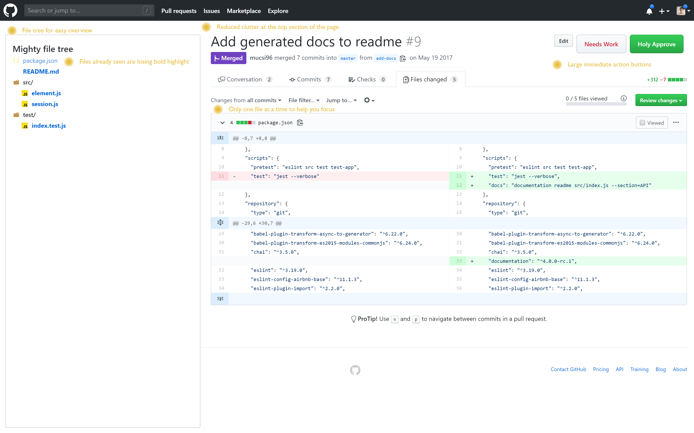

# Mighty GitHub Pull Requests

Chrome Extension to restyle Pull Request screen for easier navigation and more focused review sessions.

## Install

Install it from Google Chrome Web Store:

## Main features

- **works on corporate enterprise domains**, you just need to enable in the context menu of the extension in Chrome toolbar
- file tree on the left hand side
  - **folders are collapsible**
  - **folders are as concise as possible** (if a folder containing on single folder it is merged with parent in visualization)
  - **deleted files** are red and crossed through in file tree
  - **seen files** bacome non-highlighted
- only **one single file's diff is shown** if a file is selected from the tree
- large, visible **Approve** and **Needs work** buttons added
    - 'Need work' button automatically adds a generic *'Please fix review items'* comment.
- **clutter is reduced** - elements on the top of the page is eliminated i nthe file navigation view to eliminate visual noise

